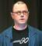

# Projeto de Estudo: Explorando a Linguagem de Programação Go

# Prefácio
- [ ] Origens de Go
- [ ] Projeto Go

# Notas

"Go é uma linguagem de programação de código aberto que facilita a criação de softwares simples, confiáveis e eficientes." (golang.org)

Ano de criação: 2007
Criadores (Google): 

[Robert Griesemer](https://github.com/griesemer)

[Rob Pike](https://github.com/robpike)

[Ken Thompson](https://pt.wikipedia.org/wiki/Ken_Thompson)

# Meu Projeto

Bem-vindo ao meu incrível projeto!

## Links

- [Google](https://www.google.com)
- [GitHub](https://www.github.com)

## Logo

